# forecasting_net_prophet
Analysing the financial and user data of an e-commerce company in Latin America with more than 200 million users to help the company grow further.

   

Google Search traffic data just for the month of May 2020 is as follows: 
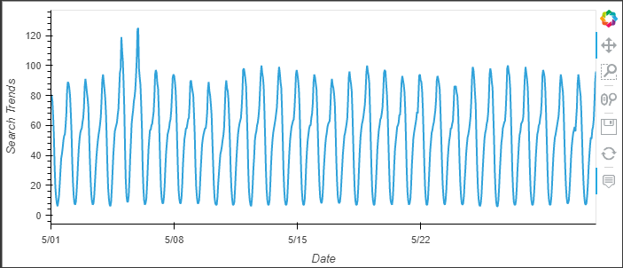

   

The monthly median search traffic across all months is 35712.5

  

<b> Question: </b> Did the Google search traffic increase during the month that MercadoLibre released its financial results?

<b> Answer: </b> Yes during the month of May 2020, when MercadoLibre released its quarterly financial results, the Google search traffic did increase to 51.318548 compared to the overall monthly median value of the search traffic of 48.128739 .

   

Average traffic by the day of the week is as follows: 
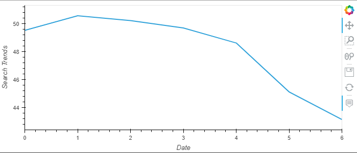

   

Search traffic as a heatmap for each day of the week: 
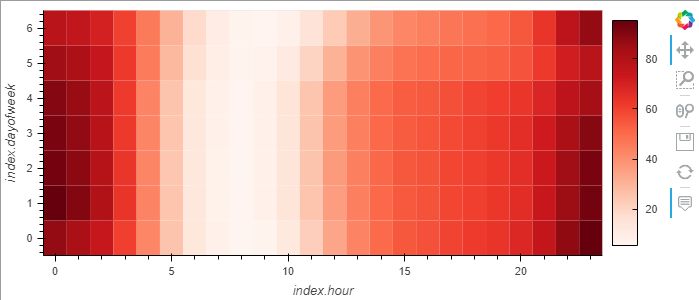

  

<b> Question: </b> Does any day-of-week effect that you observe concentrate in just a few hours of that day?

<b> Answer: </b> Based on the graph above, it looks like the search traffic is highest during 11 pm to mid-night in the weekend on Sunday and Saturday (i.e. day 0 and 6) and from 11 pm to 1am on Monday, Tuesday, Wednesay and Thursday (i.e. day 1, 2, 3 and 4). There not same intensity of search traffic during 11 pm to 1 am on Friday (i.e. day 5), compared to the other weekdays from Monday to Thursday.

   

Search data by the week of the year is as follows: 
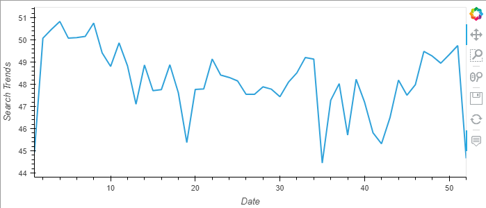

   

<b> Question: </b> Does the search traffic tend to increase during the winter holiday period (weeks 40 through 52)?

<b> Answer: </b> Yes the search traffic tend to increase during the winter holiday period i.e. from weeks 40 through 52.

   

Stock Price data:  
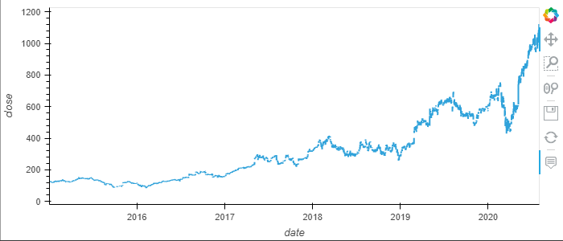

   

Slice of data to just the first half of 2020:  
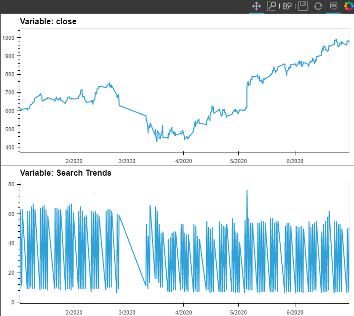

   

<b> Question: </b> Do both time series indicate a common trend that’s consistent with this narrative?

<b> Answer: </b> After the initial shock to the global financial markets during the month of March 2020, there is a gradual increase in the new customers and revenue increased for e-commerce platforms. The Closing price of the company increased after the intial market shock in March 2020. Also the Search Trends increased consistently in the same narrative.

   

Stock Volatility:  
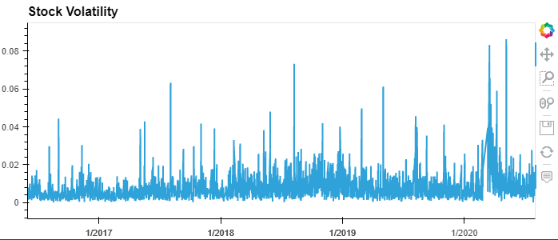
<b> Note: </b> Note how volatility spiked, and tended to stay high, during the first half of 2020. This is a common characteristic of volatility in stock returns worldwide: high volatility days tend to be followed by yet more high volatility days.

   

<b> Question: </b> Does a predictable relationship exist between the lagged search traffic and the stock volatility or between the lagged search traffic and the stock price returns?

<b> Answer: </b> No there is no such predictable relationship exists between variables of the lagged search traffic and the stock volatility or between the lagged search traffic and the stock price returns.

   

Forecast for stock price:  
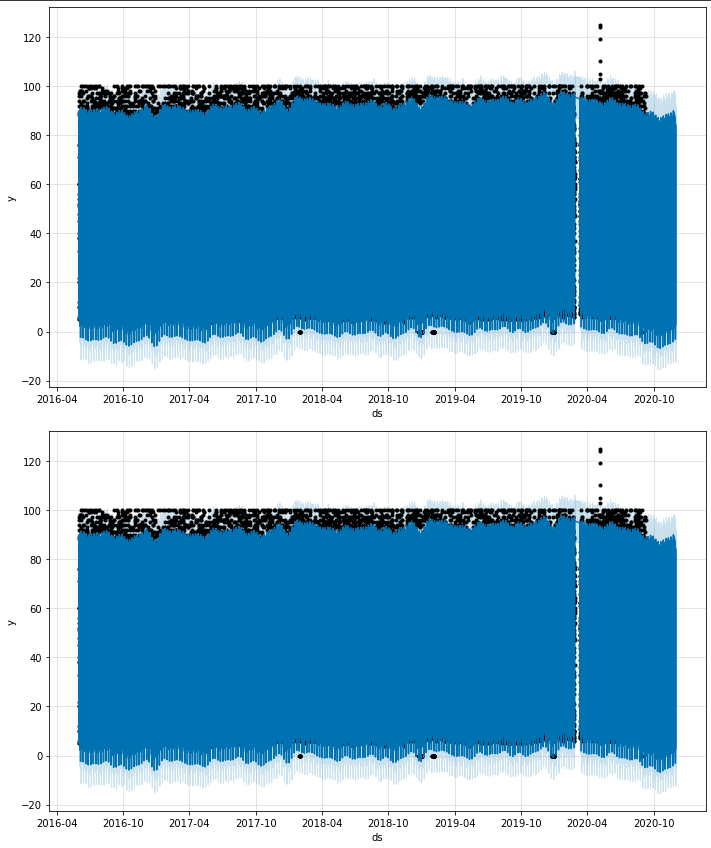

   

<b> Question: </b> How's the near-term forecast for the popularity of MercadoLibre?

<b> Answer: </b> There is a increase in popularity of the near-term forcast of MercadoLibre.

   

Model for stock price forecast:  
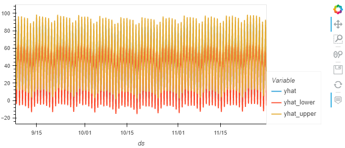

   

Time series components of the model for the stock price forecast:  
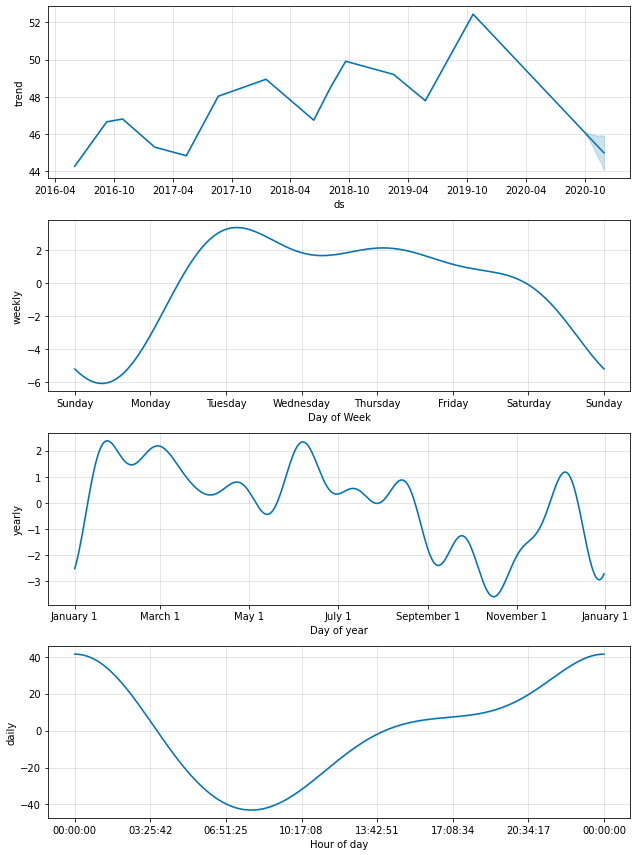

   

<b> Question: </b> What time of day exhibits the greatest popularity?

<b> Answer: </b> The popularity is greatest around the mid-night time of the day. Popularity increases steadily after 8:30 pm till mid-night and then starts to decrease.

   

<b> Question: </b> Which day of week gets the most search traffic?

<b> Answer: </b> Tuesdays have the most search traffic.

   

<b> Question: </b> What's the lowest point for search traffic in the calendar year?

<b> Answer: </b> October is the lowest month for search traffic in a calendar year.

   

Historical Sales Revenue:  
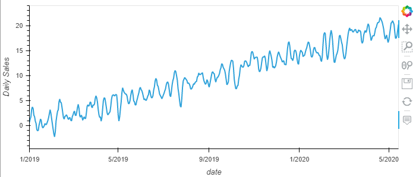

   

Time series components of the model for the daily sales revenue forecast:  
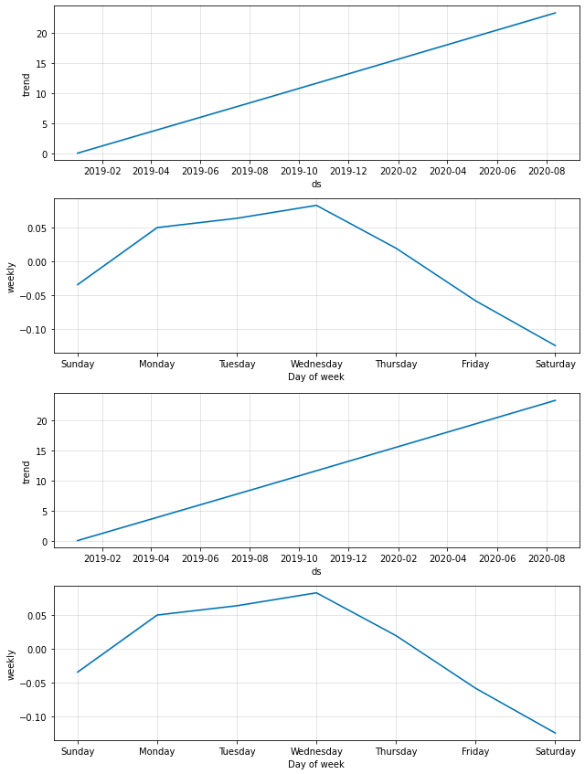

   

<b> Question: </b> For example, what are the peak revenue days? (Mondays? Fridays? Something else?)

<b> Answer: </b> Revenue is at peak on Wednesdays of the week.

   

Forecast for daily sales revenue:  
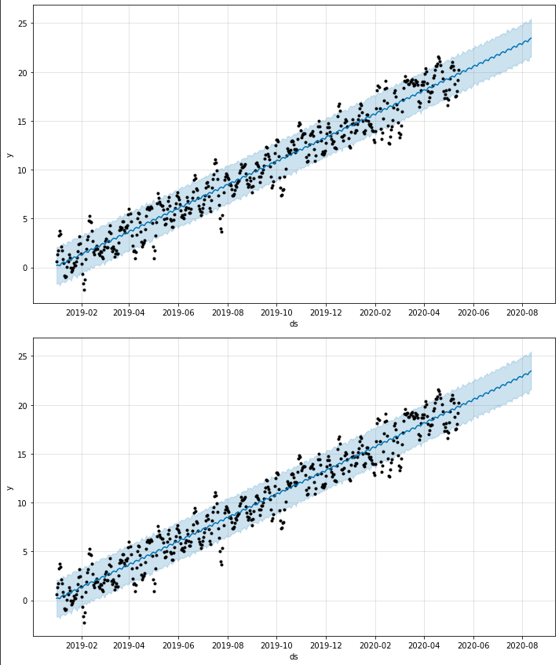

   

<b> Analysis Report: </b>  
Based on the forecast information generated above, the sales forecast for the finance division, with the expected total sales next quarter and the best and worst case scenarios. This will help to better help the finance team plan. 

<b> Answer: </b> Total sales revenue in the next quater is most likely to be 969.607769. In the best case sales in next quarter may go as high up to 1050.318316 and worst case would be 887.452342
